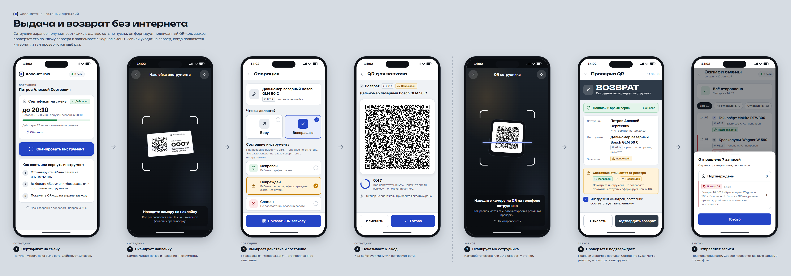

# AccountThis — дизайн интерфейса (вариант 1)

Макеты веб-приложения учёта и выдачи инструмента. Это картинки и их исходники, не работающий продукт:
данные вымышлены, «сейчас» на всех макетах — вторник, 29.09.2026, 14:02.

## Что в папке

| Путь | Что это |
|---|---|
| `screens/*.png` | 34 доски с макетами — основной результат |
| `api-notes.md` | Замечания к API, найденные при проектировании, и открытые вопросы |
| `review.md` | Перепроверка: сверка экранов с api.yaml и описанием проекта, найденные и исправленные дефекты |
| `source/` | Исходники макетов (HTML/CSS/JS), из которых сняты PNG |

## Как я понял продукт

- **Сотрудник** (телефон) перед сменой, пока есть интернет, получает сертификат на 12 часов. Дальше сеть не нужна:
  сканирует наклейку инструмента, выбирает «Беру / Возвращаю» и состояние, показывает завхозу QR-код (живёт 60 секунд).
- **Завхоз** (телефон или компьютер у стойки) сканирует этот QR и проверяет его без сети по ключу сервера:
  подписи, срок сертификата, время, повтор. Расхождения с реестром — предупреждения, решает он сам.
  Записи копятся на устройстве и уходят на сервер, когда появляется интернет. Ещё он ведёт реестр и печатает наклейки.
- **Владелец** (компьютер) подтверждает регистрации, увольняет, списывает инструмент и разбирает журнал:
  подозрительные записи, у кого инструмент пострадал, что долго на руках.

## Доски

| Файл | Что показано |
|---|---|
| `00-main-flow` | Главный сценарий от сертификата до отправки записей, 7 шагов |
| `01-design-system` | Цвета (светлая и тёмная тема), шрифты, кнопки, поля, как показывать каждое значение enum, иконки, наклейки |
| `02-login`, `03-login-errors` | Вход на телефоне и компьютере; 401, 403 «не подтверждён», 403 «уволен», нет сети, истёкшая сессия |
| `04-register` | Регистрация, ошибки полей (400), занятый номер (409), «заявка отправлена» |
| `05-worker-home` | Главная сотрудника: сертификат действует / скоро истечёт / не получен / истёк без сети / не выдан (403) |
| `06-worker-scan` | Камера для наклейки, «не тот код», нет доступа к камере |
| `07-worker-operation-qr` | Выбор действия и состояния, QR-код с таймером, устаревший QR-код |
| `08-issuer-shift-phone`, `09-issuer-shift-desktop` | Смена завхоза: готовность к работе без сети, очередь отправки, счётчики; нет сети, первый запуск, истёкший вход |
| `10-issuer-scan` | Сканер: камера телефона и поле для 2D-сканера на компьютере |
| `11`–`13-issuer-verify-*` | Результат проверки QR: всё в порядке, 3 вида предупреждений, 5 причин отказа |
| `14-issuer-records` | Записи смены, итог отправки, отложенная запись (400 `[i].qr`) |
| `15`–`17-tools-*` | Реестр: таблица, «стенд» (как инструментальная стена), телефон, пустой реестр |
| `18-tool-new` | Добавление инструмента и наклейка с присвоенным номером |
| `19`–`21-tool-card*` | Карточка инструмента, история, ручное изменение состояния, списание, списанный инструмент |
| `22-stickers` | Печать наклеек: лист А4 (24 шт. 70×37 мм) и термопринтер 58×40 мм |
| `23`–`25-journal*` | Журнал операций, разбор записи с флагом, телефон |
| `26`, `27-owner-overview*` | Обзор владельца: цифры, «требует внимания», график за 14 дней, повреждения при возврате |
| `28`–`30-users*` | Пользователи: заявки, работают, уволены; диалоги подтверждения владельца, увольнения, отказа |
| `31-states-and-errors` | Ответы 401/403/404/409, сбой сети с traceId, ошибки полей, уведомления, загрузка, пустые экраны |
| `32-dark-phone`, `33-dark-desktop` | Тёмная тема |

## Ключевые решения

- **Одно приложение на три роли.** Разделы и меню зависят от роли в JWT. На компьютере — боковая панель, на телефоне — нижние вкладки.
  Сотруднику меню не нужно: у него один сценарий.
- **Нет сети — нормальный режим, а не ошибка.** Статус сети серый, без тревоги. Завхоз видит, готово ли устройство
  к оффлайну (ключ сервера, реестр, часы, вход) и сколько записей ждут отправки.
- **Цвет всегда с иконкой и словом.** Синий — только действия и «на руках». Зелёный / жёлтый / красный — только смысл:
  исправен / повреждён / сломан, подтверждено / требует проверки / подозрительно.
- **Флаги проверки объяснены простыми словами** и разбиты на три группы: подтверждённые, требуют проверки
  (`EXPIRED_TOKEN`, `TIME_DRIFT`, `UNKNOWN_TOOL`), подозрительные (`INVALID_*`, `DUPLICATE`). Сырые значения enum в интерфейс не выводятся.
- **Результат проверки QR читается с расстояния:** полоса «ВЫДАЧА» (синяя) / «ВОЗВРАТ» (графит) / «QR ОТКЛОНЁН» (красная).
  При предупреждении кнопка подтверждения активна только после отметки «осмотрел».
- **QR-код сотрудника всегда чёрный на белом**, даже в тёмной теме; рядом таймер на 60 секунд.
- **Необратимое — только через диалог с последствиями:** списание, увольнение, отказ в заявке, подтверждение владельца.
- **ФИО не склоняем:** «На руках · Петров А. С.», а не «у Петрова». Склонение произвольных фамилий ненадёжно.
- **Стенд инструментов:** взятый инструмент оставляет пунктирный силуэт с именем, как пустое место на инструментальной стене;
  сломанный помечен сигнальной лентой.

## Для фронтенда

- `source/tokens.css` — готовые CSS-переменные (цвета обеих тем, шрифты, отступы, радиусы). Их можно перенести во `frontend/src` как есть.
- `source/app.css` — стили всех компонентов макетов; пригодятся как образец. В макетах вместо `@media` используются
  контейнерные запросы к рамке устройства: `@container app (min-width: 900px)` в приложении означает `@media (min-width: 900px)`.
- Шрифты — Unbounded, Golos Text, JetBrains Mono (все с кириллицей). В приложении подключать локально (`@fontsource/*`),
  иначе оффлайн они пропадут.
- QR-коды на макетах — имитация узора нужной плотности, не настоящие коды.

## Как посмотреть и пересобрать

- Открыть `source/index.html` в браузере — все доски подряд (нужен интернет для шрифтов).
- Пересобрать PNG: `node design/source/export.mjs` (Node.js 22+, Chrome или Edge). Одну доску: `node design/source/export.mjs flow`.
